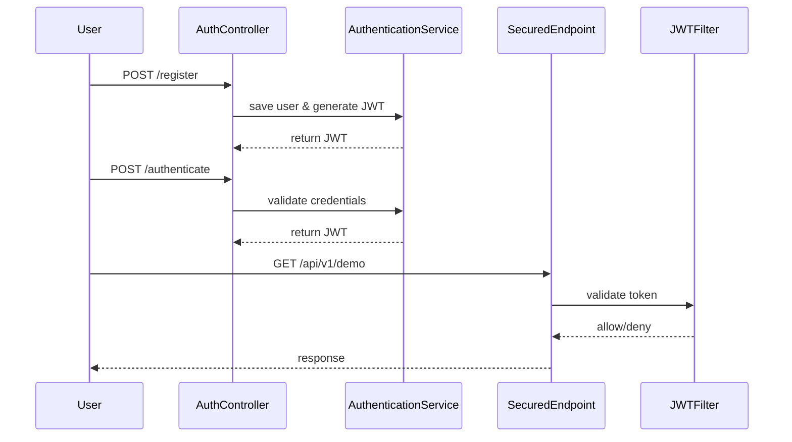

# Spring Boot JWT Authentication

[](https://www.oracle.com/java/)
[](https://spring.io/projects/spring-boot)
[](LICENSE)

This project is a **Spring Boot REST API** implementing **JWT-based authentication**.  
It demonstrates **user registration, login, and securing endpoints** using JWT tokens.

---

## Features

- User registration with encrypted passwords (`PasswordEncoder`)  
- Login with JWT token generation  
- Secured endpoints requiring valid JWT tokens  
- Role-based access (`USER` role included)  
- Works with Spring Security and Spring Data JPA  

---

## Technologies Used

- Java 21 
- Spring Boot 3  
- Spring Security  
- JWT (JSON Web Token)  
- Maven  
- Lombok  
- H2 / postgreSQL (configurable)  

---

## Architecture & JWT Workflow


## Getting Started
1. Clone the repository via SSH
 ```bash
   git clone github.com:gilbert-rgb/springboot-jwt_security.git
cd jwt_security
````
2. ## Configure application properties

Edit src/main/resources/application.yml or use environment variables:


spring:
  datasource:
    url: jdbc:postgresql://localhost:5432/jwt_security
    username: 
    password: 
    driver-class-name: org.postgresql.Driver
  jpa:
    hibernate:
      ddl-auto: create-drop
    show-sql: true
    properties:
      hibernate:
        format_sql: true
    database: postgresql
    database-platform: org.hibernate.dialect.PostgreSQLDialect
    
3. ## Build and Run

Using terminal:
```bash
mvn clean package
mvn spring-boot:run
java -jar security-0.0.1-SNAPSHOT.jar
```
Or using IntelliJ:

Open ```SecurityApplication.java```` → Right-click → Run

 ### API Endpoints

Endpoint	                    Method	        Description
```/api/v1/auth/register```	   POST	           Register a new user
```/api/v1/auth/authenticate```POST	           Login and get JWT token
```/api/v1/demo```             GET	           Secured test endpoint
Example Requests

Register a user:

POST /api/v1/auth/register
```bash
{
  "firstname": "Gilbert",
  "lastname": "Cheboi",
  "email": "Gilbert@gmail.com",
  "password": "1234"
}
```
Login:

POST /api/v1/auth/authenticate
```bash
{
  "email": "gilber@gmail.com",
  "password": "password123"
}
```
Access secured endpoint with JWT:

GET /api/v1/demo
Authorization: Bearer <JWT_TOKEN>

 #### License

MIT License © gilbert-rgb
